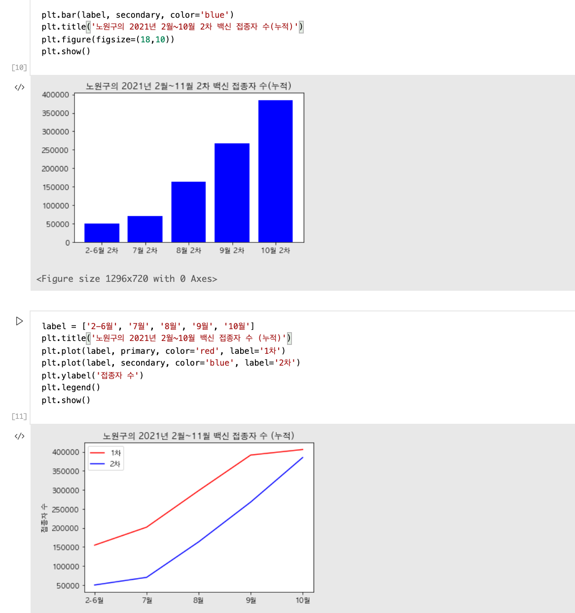

# OpenSource

### ➰ Term Project Proposal

**👩 컴퓨터공학과 오예진 19101243**
  
   
  
 ## 작품 소개 : 노원구 백신 접종자 수 데이터 시각화 및 예측 프로젝트
> ### 개요 (작품을 만들고자 한 계기)
> * 코로나 19 및 백신패스도입 여파로 백신 접종률이 높아지고 있는 상황에서 얼마나 많은 사람들이 백신을 맞고 있는지, 현황에 대한 데이터가 궁금해졌다.
> * 따라서, 서울특별시 자치구별 코로나19 백신접종현황 공공데이터를 이용해 내가 살고있는 노원구의 백신 접종자 수를 시각화하고자 한다.
> * 또한 시각화를 넘어서 데이터를 가지고 **ARIMA**를 이용해 11월 이후 백신 접종자 수를 예측해보고자 한다.
 

 ## 작품 기능
> * 노원구의 2021년 2월~10월 1차 백신 접종자 수(누적) 그래프
> * 노원구의 2021년 2월~10월 2차 백신 접종자 수(누적) 그래프
> * 노원구의 2021년 2월~10월 백신 접종자 수 (누적) 그래프
> * 10월 이후 2차 누적 접종자수 예측
 

 ## Data
> * [서울특별시 자치구별 코로나19 백신접종현황 공공데이터](https://www.data.go.kr/data/15094083/fileData.do)
 

 ## Libraries
> * pandas
> * numpy
> * matplotlib
> * statsmodels
 

 ## Preview
 

 ## License
> * Apache License 2.0
